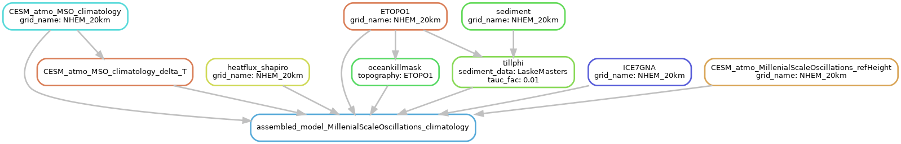

[Snakemake](https://snakemake.github.io/) workflow for my PISM experiments.
This handles input data preprocessing (download, conversion of units, remapping, merging), model runs
(can submit to SLURM on HLRN directly), tuning (expanding variable combinations via itertools product)
and postprocessing (visualization).


```
snakemake --cores 4 results/PISM_file/MillenialScaleOscillations_climatology_NHEM_20km.nc
```

#### Show the graph
```
snakemake --forceall --dag results/PISM_file/MillenialScaleOscillations_climatology_NHEM_20km.nc | dot -Tpng > dag.png
```




> **Note**
> pynco must be installed from github!
>
> put this in the environment:
> ```
> git+https://github.com/nco/pynco/
> ```
