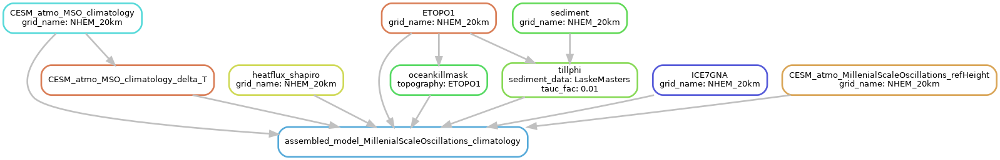

[Snakemake](https://snakemake.github.io/) workflow for my PISM experiments.
This handles input data preprocessing (download, conversion of units, remapping, merging), model runs
(can submit to SLURM on HLRN directly), tuning (expanding variable combinations via itertools product)
and postprocessing (visualization).


> **Note**
> pynco must be installed from github!
>
> put this in the environment:
> ```
> git+https://github.com/nco/pynco/
> ```

### Examples

#### prepare dataset

```
snakemake --cores 4 results/PISM_file/MillenialScaleOscillations_climatology_NHEM_20km.nc
```

#### submit slurm
```
snakemake --profile slurmsimple gi_heinrich_first
```

#### Show the graph
```
snakemake --forceall --dag results/PISM_file/MillenialScaleOscillations_climatology_NHEM_20km.nc | dot -Tpng > dag.png
```



#### plots


